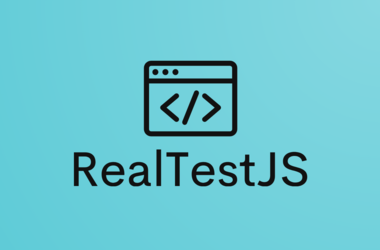

<p align="center">
  <a href="./logo/logo.png">
    <picture>
      
    </picture>    
  </a>
</p>

<p align="center">
  <a href="./CHANGELOG.md">Changelog</a> 
</p>
<p align="center" style="font-size:120%;">
  Fast, easy and reliable testing for anything that runs in JS.
</p>

## Getting started

> Before you follow the steps below, make sure you have the

[Node.js](https://nodejs.org/en/download/) installed _globally_ only your system

## Installing

Install RealTestJS for Mac, Linux, or Windows:

```bash
npm install real-test-js --save-dev
```

or

```bash
yarn add real-test-js --dev
```

## Write test:

Use the it function to write test cases and the describe function to group them.

### `Example↓`

test.js

```
import { describe, test, beforeEach, afterEach, expect} from '../src/core.mjs'

describe('First describe', () => {
  beforeEach(() => {
    // you're code
  })
  afterEach(() => {
    // you're code
  })
  // you're code
  test('First it inside first describe', () => {
    const number = 1
    expect(number).toBeDefined()
  })
})


describe('Second describe', () => {
  beforeEach(() => {
    // you're code
  })
  afterEach(() => {
    // you're code
  })
  // you're code
  test('First it inside second describe', () => {
    const arr = [1, 2, 3]
    expect(arr).toHaveLength(3)
  })
})
```

## Run test:

```bash
npx real-test-js --spec="test.js"
```

or

```bash
yarn real-test-js --spec="test.js"
```

Where **--spec=** your test file path

## `Available CLI Options`

To run with config file **--config=** CLI arg:

```bash
npx real-test-js --config="your_config_name.config.json"
```

or

```bash
yarn real-test-js --config="your_config_name.config.json"
```

## `Configuration via config file`

- `your_config_name.config.json` - config for Real Test JS (works as an engine)

### `Example↓`

test.config.json

```
{
    "specFile": "your_folder/your_file.js"
}
```

---

| Option Name  | Required | Type   | Description           |
| ------------ | -------- | ------ | --------------------- |
| `"specFile"` | true     | string | path to the test file |

---

## `Test runner API`

---

| Option Name    | Description                                                                           |
| -------------- | ------------------------------------------------------------------------------------- |
| `"test"`       | `test` is where you perform individual tests                                          |
| `"describe"`   | `describe` is for organizing and grouping tests. Describe can be nested in `describe` |
| `"beforeEach"` | Command allows to define setup tasks at the beginning of every It block               |
| `"afterEach"`  | Command allow to define teardown tasks at the end of every It block                   |
| `"beforeAll"`  | Command allow to define setup tasks at the beginning of describe block                |
| `"afterAll"`   | Command allow to define teardown tasks at the end of describe block                   |

---

## `Assertions`

Use `expect(actual_value)` with assertions:

### `Example↓`

```
  const arr = [1, 2, 3]
  expect(arr).toHaveLength(3)
```

---

| Assert Name       | Description                                                                         |
| ----------------- | ----------------------------------------------------------------------------------- |
| `.toBeDefined()`  | Check actual value to be not undefined `expect(1).toBeDefined()`                    |
| `.toHaveLength()` | Check actual array length to have expected value `expect(arr).toHaveLength(number)` |
| `.toBeFalsy()`    | Check actual value to be false                                                      |

---
